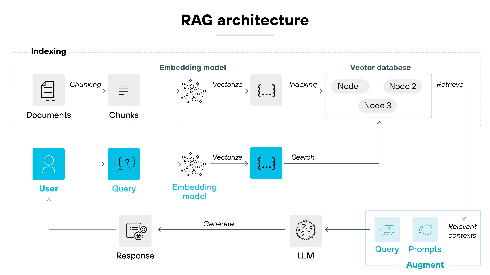

# LegalTone AI

## AI-Powered Multi-Agent Legal Intelligence Platform

LegalTone AI is a next-generation legal document analysis platform powered by:

- Multi-Agent AI Systems
- Retrieval-Augmented Generation (RAG)
- Vector Search
- Hybrid LLM Routing
- PDF Clause Highlighting
- Streaming AI Responses
- Legal Risk Intelligence

The system analyzes agreements, extracts clauses, detects legal risks, generates recommendations, and grounds responses directly inside uploaded PDF documents.

---

# Features

## Multi-Agent AI Architecture

The platform uses specialized AI agents:

| Agent | Responsibility |
|---|---|
| Summary Agent | Agreement understanding |
| Risk Agent | Legal exposure analysis |
| Clause Agent | Clause extraction |
| Tone Agent | Contract tone analysis |

---

## Retrieval-Augmented Generation (RAG)

LegalTone uses:

- Semantic chunking
- Vector embeddings
- ChromaDB retrieval
- Context-grounded responses

to reduce hallucinations and improve legal reasoning accuracy.

---

## PDF Intelligence

- PDF Upload & Parsing
- Source Grounding
- Clause Citations
- Page Highlighting
- Exact Text Highlighting

---

## AI Risk Engine

The platform computes:

- Legal Exposure Score
- Clause-level risks
- Recommendations
- Missing clause analysis

---

## Streaming AI Responses

Responses stream progressively:

- Summary
- Tone
- Risk
- Clauses

for faster UX and real-time AI interaction.

---

# Tech Stack

## Frontend

- React.js
- Tailwind CSS
- Vite
- React-PDF

---

## Backend

- FastAPI
- Python
- Uvicorn

---

## AI / ML

- Sentence Transformers
- ChromaDB
- RAG Pipeline
- Groq LLM API
- Ollama (optional local inference)

---

## Models Used

- Llama 3.1 8B
- Llama 3.3 70B
- DeepSeek R1 Distill 70B

---

# System Architecture



```text
PDF Upload
    ↓
Document Parsing
    ↓
Chunking Pipeline
    ↓
Sentence Embeddings
    ↓
Chroma Vector Database
    ↓
Semantic Retrieval
    ↓
Multi-Agent AI System
    ↓
Streaming Structured Responses
    ↓
PDF Grounded Citations
```

---

# Installation

## Clone Repository

```bash
git clone https://github.com/Hunteringsoul/LegalTone.git
```

---

## Backend Setup

```bash
cd LegalTone

python -m venv venv
```

### Activate Virtual Environment

#### Windows

```bash
venv\Scripts\activate
```

#### Linux / Mac

```bash
source venv/bin/activate
```

---

## Install Dependencies

```bash
pip install -r requirements.txt
```

---

# Frontend Setup

```bash
cd frontend

npm install
```

Run frontend:

```bash
npm run dev
```

---

# Run Backend

```bash
uvicorn main:app --reload
```

---

# Environment Variables

Create a `.env` file in the root directory:

```env
USE_LOCAL=false

GROQ_API_KEY=your_key

GROQ_MODEL=llama-3.3-70b-versatile

OLLAMA_MODEL=llama3
```

---

# Workflow

```text
User Uploads Agreement
        ↓
Document Parsing
        ↓
Text Chunking
        ↓
Embedding Generation
        ↓
Vector Storage (ChromaDB)
        ↓
Semantic Retrieval
        ↓
Multi-Agent AI Analysis
        ↓
Streaming Structured Output
        ↓
PDF Clause Highlighting
```

---

# Example Queries

```text
Can the agreement be terminated early?
```

```text
Which clause creates the highest legal exposure?
```

```text
What are the confidentiality obligations?
```

```text
Can I sue for breach of contract?
```

---

# Future Improvements

- Multi-document comparison
- Legal recommendation engine
- Team workspace
- Authentication
- Exportable legal reports
- Clause graph visualization
- AI negotiation assistant

---

# Screenshots


---

# License

MIT License